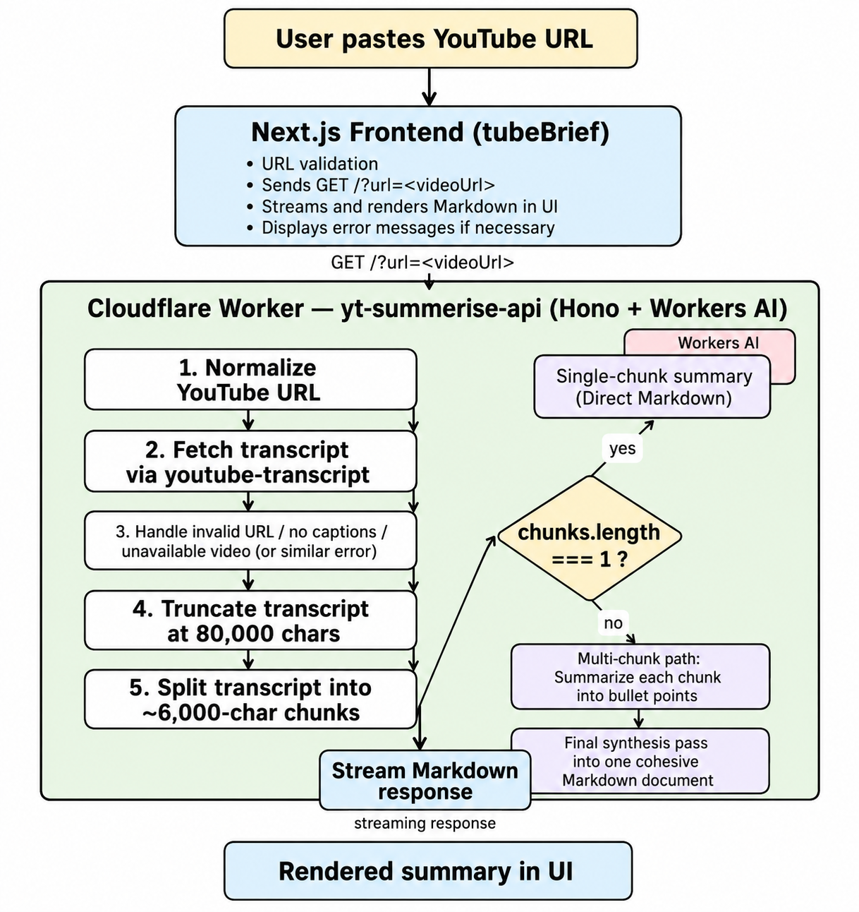

<div align="center">

<br />

<!-- Logo -->
<svg xmlns="http://www.w3.org/2000/svg" width="72" height="72" viewBox="0 0 72 72" fill="none">
  <rect width="72" height="72" rx="16" fill="#0f3638"/>
  <path d="M20 28h32M20 36h24M20 44h18" stroke="#4f98a3" stroke-width="3.5" stroke-linecap="round"/>
  <circle cx="54" cy="26" r="8" fill="#4f98a3"/>
  <path d="M50.5 26l2.5 2.5 4.5-4.5" stroke="#0f3638" stroke-width="2" stroke-linecap="round" stroke-linejoin="round"/>
</svg>

<h1>TubeBrief</h1>

<p><strong>AI-powered YouTube video summarizer — get the key points in seconds.</strong></p>

<p>Paste a YouTube URL. Get a structured Markdown summary. No watching required.</p>

<p>
  
  
  
  
  
</p>

<br />

</div>

***

## ✨ Features

- **Real-time streaming** — AI output is streamed word-by-word via Hono's `streamText` and React hooks for an instant, responsive feel
- **Smart two-pass chunking** — Long transcripts are split at sentence boundaries, summarized per section, then synthesized into one cohesive document
- **Multi-format URL support** — Handles `youtube.com/watch?v=`, `youtu.be/`, `/shorts/`, and `/embed/` links automatically
- **Retry with exponential back-off** — Transient AI failures are retried up to 3 times with doubling delays
- **Structured Markdown output** — Final output includes a title (H1), executive summary, key themes (H2), and a conclusion
- **Edge-native deployment** — Runs on Cloudflare's global network; no cold starts, low latency worldwide
- **Health endpoint** — `GET /health` for uptime monitoring and readiness checks

***


## 🏗 Architecture

<div align="center">
  
</div>

#### TubeBrief uses a Next.js frontend and a Cloudflare Worker backend to fetch transcripts, process them through Workers AI, and stream Markdown summaries back to the UI in real time.

## 📂 Directory Structure

```
TubeBrief/
├── tubeBrief/                   # Frontend (Next.js 15)
│   ├── app/                     # App Router — pages & layouts
│   ├── components/              # Shadcn UI components
│   ├── lib/                     # Utility functions & custom hooks
│   ├── public/                  # Static assets
│   ├── next.config.mjs          # Next.js configuration
│   ├── package.json             # Dependencies — managed with pnpm
│   └── tsconfig.json            # TypeScript configuration
│
├── yt-summerise-api/            # Backend (Cloudflare Worker)
│   ├── src/
│   │   └── index.ts             # Hono app + Workers AI logic
│   ├── wrangler.toml            # Cloudflare Workers configuration
│   ├── package.json             # Dependencies — managed with bun
│   ├── bun.lockb                # Bun lockfile
│   └── worker-configuration.d.ts# Generated Cloudflare types
│
└── README.md
```

***

## 🚀 Getting Started

### Prerequisites

| Tool | Version | Purpose |
|------|---------|---------|
| [Node.js](https://nodejs.org/) | 18+ | Frontend runtime |
| [pnpm](https://pnpm.io/) | Latest | Frontend package manager |
| [Bun](https://bun.sh/) | Latest | Backend runtime & package manager |
| [Wrangler CLI](https://developers.cloudflare.com/workers/wrangler/) | Latest | Cloudflare Workers deployment |

### 1. Backend — `yt-summerise-api`

```bash
cd yt-summerise-api
bun install

# Develop locally (Wrangler simulates the Workers AI binding)
bun run dev

# Deploy to Cloudflare
bun run deploy
```

> **Note:** The `AI` binding is provided automatically by Cloudflare. No API keys are required for local development via Wrangler.

### 2. Frontend — `tubeBrief`

```bash
cd tubeBrief
pnpm install

# Configure the environment
cp .env.example .env.local
# Set NEXT_PUBLIC_API_URL to your deployed Worker URL

pnpm run dev
```

Open [http://localhost:3000](http://localhost:3000) to see the app.

***

## 🛠 Tech Stack

| Layer | Technology |
|-------|-----------|
| **Frontend** | [Next.js 15](https://nextjs.org/), [Tailwind CSS](https://tailwindcss.com/), [Shadcn UI](https://ui.shadcn.com/), [Lucide React](https://lucide.dev/) |
| **Backend** | [Hono v4](https://hono.dev/), [Cloudflare Workers](https://workers.cloudflare.com/) |
| **AI Model** | [Mistral Small 3.1 (24B Instruct)](https://developers.cloudflare.com/workers-ai/models/mistral-small-3.1-24b-instruct/) via Cloudflare Workers AI |
| **Transcript** | [youtube-transcript](https://www.npmjs.com/package/youtube-transcript) |
| **Runtime** | [Bun](https://bun.sh/) (backend), Node.js 18+ (frontend) |

***

## 📡 API Reference

### `GET /?url=<youtube_url>`

Streams a structured Markdown summary of the given YouTube video.

**Supported URL formats**

```
https://www.youtube.com/watch?v=VIDEO_ID
https://youtu.be/VIDEO_ID
https://www.youtube.com/shorts/VIDEO_ID
https://www.youtube.com/embed/VIDEO_ID
```

**Response codes**

| Status | Meaning |
|--------|---------|
| `200` | Streaming Markdown response (text/plain) |
| `400` | Missing `?url=` parameter or invalid YouTube URL |
| `404` | No transcript available / captions disabled |
| `502` | Video is private, deleted, or unavailable |

***

### `GET /health`

Returns a JSON readiness check — useful for uptime monitors.

```json
{ "status": "ok", "ts": 1715820000000 }
```

***

## ⚙️ Configuration

All tuneable constants live in `yt-summerise-api/src/index.ts`:

```ts
const CONFIG = {
  model: "@cf/mistralai/mistral-small-3.1-24b-instruct",
  chunkSize: 6_000,         // characters per transcript chunk
  maxTranscriptLen: 80_000, // hard cap before truncation
  maxRetries: 3,            // AI call retry attempts
  retryBaseMs: 500,         // exponential back-off base (ms)
} as const;
```

***

## 🤝 Contributing

1. Fork the repository
2. Create a feature branch: `git checkout -b feat/your-feature`
3. Commit using [Conventional Commits](https://www.conventionalcommits.org/): `git commit -m "feat: add your feature"`
4. Push and open a Pull Request against `main`

***

## 📝 License

This project is licensed under the [MIT License](./LICENSE.txt).
